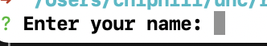
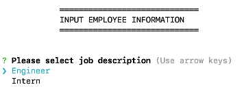
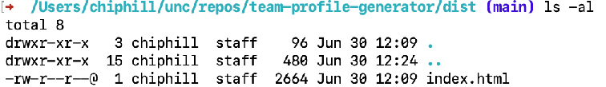

# Project Title - TEAM-PROFILE-GENERATOR

Repository: https://github.com/roo116/team-profile-generator

## Project Description

Creates an HTML page with work team-members.

## Table of Contents

- [Installation](#installation)
- [Usage](#usage)
- [License](#license)
- [Contributing](#contributing)
- [Tests](#tests)
- [Questions](#questions)

## Installation

Fork or clone https://github.com/roo116/team-profile-generator

run `npm i` at the command prompt.

## Usage

Video Demonstration:  
https://drive.google.com/file/d/1g-xAjvPzv7yALMzdqAOPeIqJ_BhWX9fZ/view?usp=sharing

Type `node index` at the command prompt and answer the questions.  
The assumption is only the manager of the team will be entering this information. As a result the first set of questions are specific to the user entering the answers.  

Once the manager questions are answered, the user will then be presented with options to enter data for either Engineers or Interns, and will continue to prompt until the user has entered all employee data.  

The application will output an index.html file in the ./dist folder of the application directory.

example:  

## License

This is licensed under the MIT license. See the badge for the link to the license information.

## Contributing

no contribution information at present.

## Tests

Tests were performed to ensure objects would create successfully, using Jest.  

Here is the video output of those tests. 

## Questions

If you have questions, reach out via email or GitHub  
Gitub: [GitHub Repository](https//github.com/roo116)  
Email: hillkarl03@gmail.com  

